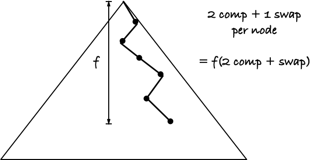

# Binary heap

There is a trick often used when implementing binary heaps. It doesn't always give you anything, it very much depend on the application, but once you know it you can judge for yourself if it is worth considering.

The idea is based on the observation that if we have inserted and deleted many times, the smaller values will likely be closer to the root, so when we pull out a value from the lowest level and let it fall down through the layers, it mostly ends near the bottom once again.

The version of `fix_down()` you have seen looks at both children of a node and then swap the current value with the smallest of its children. That involves two comparisons--find out which is the smaller child and find out if you should swap--and then it involves one swap. So, if the initial value in the root moves down to depth `f`, you will use `f(2 comp + swap)` operations.

An alternative approach is to always swap the current value with the smallest child--there you only need one comparsion to work out which is the smaller child. You won't stop in time, though, so if the heap is `d` deep in total, you perform `d(comp+swap)` operations and the value is now too deep. You need to get it back up again, but a `fix_up()` will move it up. In `fix_up()` we only compare a node with its parent, so one comparison, so fixing up again takes `(d-f)(comp + swap)`. In total we have spent `f` comparisons and swaps going down to the right level, and then `2(d-f)` comparisons and swaps going too far and fixing up again.

Compairing their efficiency on swaps is straightforward. The first swaps `f` times and the second swaps `f + 2(d-f)` times; clearly the second is worse if swaps are expensive and comparisons less so.

What about comparisons, though? Could there be some benefit to overshooting if `f` is a large fraction of `d`, so we only do half the work on the `f` part at the cost of doing extra `2(d-f)` comparisons?

**Exercise:** Implement the new `_fix_down()` function in `src/heap.py`.

**Exercise:** Work out when one approach might be better than another.
